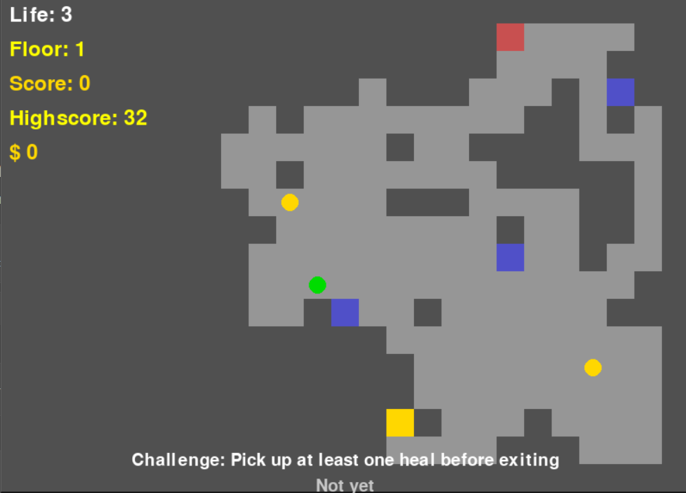

# Dungeon Roguelike


Jogo **Roguelike Dungeon Crawler** em Pygame, com geração procedural de masmorras, desafios dinâmicos, loja de upgrades, internacionalização (4 idiomas) e sistema de medalhas. Minimalista, expansível e divertido!

---

## Índice

- [Demonstração](#demonstração)
- [Funcionalidades](#funcionalidades)
- [Instalação](#instalação)
- [Uso](#uso)
- [Checklist de Progresso](#checklist-de-progresso)
- [Contribuição](#contribuição)
- [Licença](#licença)
- [Autores](#autores)
- [Agradecimentos](#agradecimentos)

---

## Demonstração



---

## Funcionalidades

- **Geração Procedural** de masmorras com conectividade garantida
- **Player** com movimentação por grid e HUD completa
- **Inimigos** com IA básica (aleatório e perseguidor)
- **Itens** de cura e tesouro, com coleta dinâmica
- **Loja (SHOP)** acessível por tecla `B` para upgrades
- **Desafios** únicos a cada andar, medalhas colecionáveis e pontuação
- **Interface multilíngue:** Português, Inglês, Espanhol e Francês
- **Tela de pausa, game over, HUD contextual**
- **Sistema de som** para eventos importantes
- **Persistência** de recorde (highscore)
- Expansível para armas, magias, saves, etc.

---

## Instalação

1. **Clone o repositório:**
   ```bash
   git clone https://github.com/michelbr/dungeon-roguelike.git
   cd dungeon-roguelike
````

2. **Crie um ambiente virtual (opcional, mas recomendado):**

   ```bash
   python -m venv venv
   source venv/bin/activate  # Linux/macOS
   venv\Scripts\activate     # Windows
   ```

3. **Instale as dependências:**

   ```bash
   pip install pygame
   ```

4. **(Opcional) Ajuste o caminho dos assets se necessário.**

---

## Uso

Execute o jogo com:

```bash
python main.py
```

* **Mover:** WASD ou Setas
* **Abrir loja:** B (aparece dica ao pegar a 1ª moeda)
* **Pausar:** ESC
* **Recomeçar:** R (após Game Over)
* **Trocar idioma:** L (na tela inicial)

O progresso de moedas, vida máxima e medalhas é mantido entre andares.

---

## Checklist de Progresso

### MVP - Estrutura, Gameplay e Núcleo

* [x] Pastas: `/src`, `/assets`, `/levels`, `/saves`
* [x] Arquivos: `main.py`, `config.py`
* [x] Geração procedural (`dungeon.py`)
* [x] Jogador (`player.py`), HUD, moedas acumulam
* [x] Inimigos (`enemy.py`), IA simples e perseguidor
* [x] Itens (`item.py`), coleta, moedas, cura
* [x] Andares/portas, transição, manter progresso
* [x] Desafios e medalhas por andar
* [x] Loja acessível com upgrades (+vida, cura, invulnerável)
* [x] Som e efeitos básicos

### UX, Polimento & Internacionalização

* [x] i18n: pt, en, es, fr
* [x] HUD completa, dicas contextuais, tela de pausa/loja integradas
* [ ] Dica automática da loja ao pegar a 1ª moeda
* [ ] Garantir fontes compatíveis unicode
* [ ] Mensagem após compra/venda na loja
* [ ] Corrigir bug de símbolos (exibir `$` seguro)
* [ ] Garantir moedas acumulam sempre entre andares/game over

### Expansões Futuras

* [ ] Novos inimigos e armadilhas
* [ ] Mais upgrades e itens na loja
* [ ] Armas, magias, buffs
* [ ] NPCs, quests, diálogos
* [ ] Gráficos, animações, efeitos sonoros avançados
* [ ] Sistema de saves/meta-progresso
* [ ] Rank online, desafios diários/semanais

---

## Contribuição

Contribuições são bem-vindas!

1. Faça um fork deste repositório
2. Crie sua branch (`git checkout -b minha-feature`)
3. Commit suas mudanças (`git commit -am 'Nova feature'`)
4. Faça push para sua branch (`git push origin minha-feature`)
5. Abra um Pull Request

Confira as [issues](https://github.com/michelbr/dungeon-roguelike/issues) ou discuta melhorias conosco.

---

## Licença

Distribuído sob a [Licença MIT](LICENSE).

---

## Autores

* [Seu Nome](https://github.com/michelbr) — dev principal
* Colabore você também! Envie sugestões, traduções ou código.

---

## Agradecimentos

* Comunidade Pygame
* Repositórios open-source de Roguelikes que inspiraram este projeto
* Quem testou, reportou bugs e sugeriu melhorias :)

---

*Dungeon Roguelike: um projeto educativo, divertido e open-source. Compartilhe, jogue, hackeie e evolua junto!*